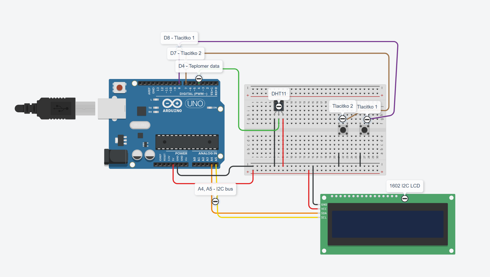

# Arduino teploměr

Tento projekt se zaměřuje na jednoduchý teploměr postavený na Arduinu. Změří teplotu okolí a zobrazí ji na displeji. Dá se přepínat mezi stupni Celsia a Fahrenheitu.

---

## 1. Jak zařízení zapojit

1. **Na sestrojení budete potřebovat:**
   - Arduino Uno
   - Nepájivé pole (breadboard)
   - Senzor DHT11 na měření teploty
   - LCD 1602 Displej (nebo 20x4, funguje na obojím)
   - 9 Samec/Samec propojovacích vodičů 
   - 4 Samec/Samice propojovací vodiče
<<<<<<< HEAD
   - Nepájivé pole (breadboard)

2. **Postup zapojení:**
   - Vše připojte podle schéma:
   
=======
   - 2 Tlačítka
   
   
2. **Postup zapojení:**
>>>>>>> 38e559875314c5640e01475b27e53133550b6363
