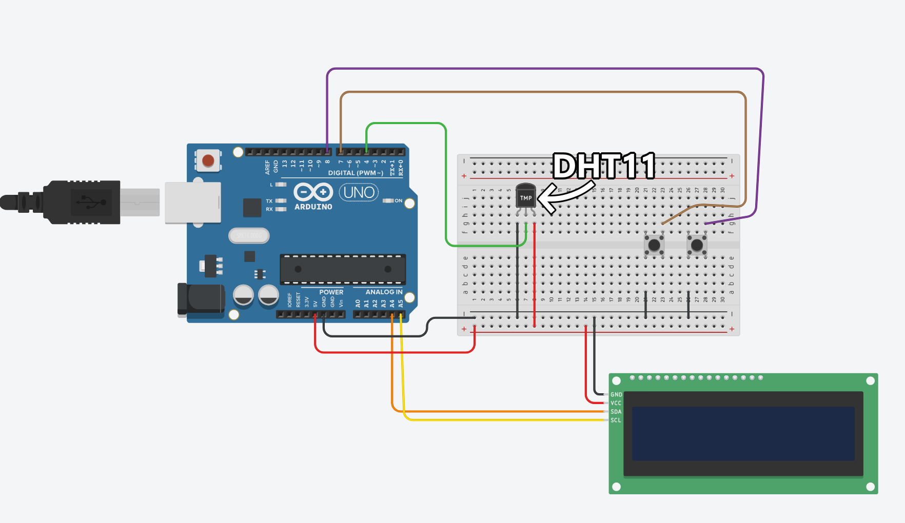
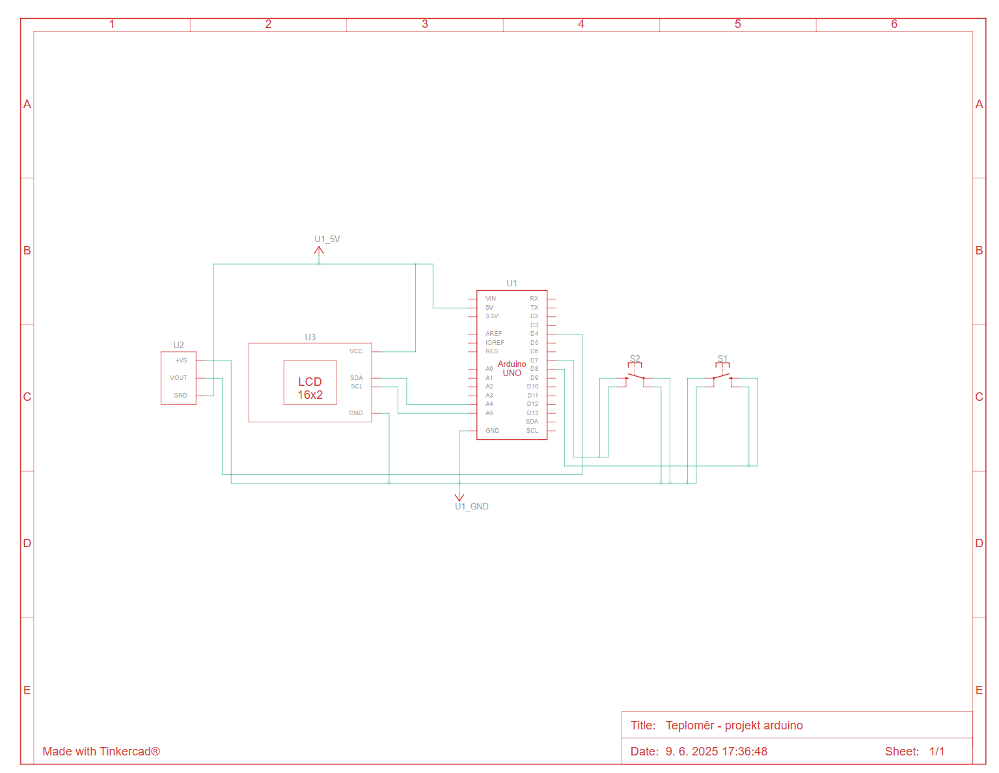

# **Arduino teploměr**

Tento projekt se zaměřuje na jednoduchý teploměr postavený na Arduinu. Změří teplotu okolí a zobrazí ji na displeji. Dá se přepínat mezi stupni Celsia a Fahrenheitu.

---

## 1. Jak zařízení zapojit

1. **Na sestrojení budete potřebovat:**
   - Arduino Uno R3
   - Nepájivé pole (anglicky breadboard - tento pojem budu v této dokumentaci používat)
   - Senzor DHT11 na měření teploty [Link na součástku použitou v projektu](https://www.laskakit.cz/arduino-senzor-teploty-a-vlhkosti-vzduchu-dht11--modul/).
   - LCD 1602 (16x2) Displej (nebo 20x4, funguje na obojím) [Link na součástku použitou v projektu](https://www.laskakit.cz/16x2-lcd-displej-1602-i2c-prevodnik/).
   - 2 Tlačítka
   - 9 Samec/Samec propojovacích vodičů
   - 4 Samec/Samice propojovací vodiče

2. **Jak zařízení zapojit:**
   - Vše připojte podle screenshotu z Tinkercadu:
   

   - Nebo podle schéma obvodu:
   
   
   - Vodič, který vede z portu SDA na displeji zapojte do A4 portu na arduinu
   - Vodič, který vede z portu SCL na displeji zapojte do A5 portu na arduinu
   - Senzor DHT11 zapojíme zadní stranou (tou, kde není ten světle modrý senzor), aby nesnímal teplotu u kabelů, ale okolí. To je proč jsou vodiče zapojené na DHT11 na breadboardu v opačném směru.

---

## 2. Jak kód stáhnout
   Kód stáhnete pomocí kliknutí na zelené tlačítko s textem "code", kde poté kliknete na "Download ZIP". Tímto stáhnete ZIP soubor, ve kterém je obsažen celý zdrojový kód.
   Nepotřebujete stahovat žádné další knihovny – vše potřebné je již zahrnuto ve zdrojovém kódu, případně je dostupné přímo v Arduino IDE.

---

## 3. Potřebné knihovny
   **Veškeré potřebné knihovny jsou již v zdrojovém kódu zahrnuty a stáhnuty, čili o to se nemusíte starat.**

---

## 4. Co lze v kódu upravit/změnit bez hrabání se ve stežějních částech kódu
   kód (nebo nastavení zařízení) mužete změnit mezi řádkem 14 až 23.

   - **Přenastavení pinu tlačítek** (řádek 15 a 16):
   ```c++
      const int TLACITKO1 = 8; // pin praveho tlacitka
      const int TLACITKO2 = 7; //pin leveho tlacitka
   ```
   číslo 8 a 7 mužete změnit za jiné, na kterém máte tlačítka připojena do arduina.

   - **Inicializace displeje** (řádek 20 až 22):
   ```c++
      // Vyber JEDEN řádek podle svého displeje:
      //LiquidCrystal_I2C lcd(0x27, 20, 4); // pro 20x4 displej
      //LiquidCrystal_I2C lcd(0x27, 16, 2);
   ```
   Odstraňte na začátku jednoho z řádku dvě lomítka, podle toho, jestli používáte displej s rozlišením 20x4 nebo 16x2.

---

## 5. Jak zařízení ovládat
- Arduino připojte k počítači a nahrajte do něj kód.
- Po spuštění se zapne automaticky displej, kde po zmáčknutí pravého tlačítka (pokud je vše zapojeno správně) by se měla ukázat teplota.
- Pomocí levého tlačítka se přepíná mezi stupnicí Celsia a Fahrenheitu. To, na jaké stupnici je zařízení nastaveno, se ukáže šipka buďto vedle C nebo F.

---

## 6. Co dělat, když zařízení nefunguje
1. **Zkontrolovat zapojení celého obvodu**
   - Ověřte, že všechno je zapojeno spravně. I kdyby to mělo znamenat odpojit a zapojit všechny vodiče, zkontrolovat celý obvod, přepojit tlačítka, senzor a displej, tak se to stejně vyplatí. Během tvoření tohoto projektu se mi to stalo tolikrát a opravdu přepojení celého obvodu to vyřešilo.

2. **Nefunguje displej**
   - Zase jak u minulého. Vypojit, zapojit displej. A pokud toto nefunguje, tak mužete v kódu zkusit změnit adresu displeje - z 0x27 na 0x20. A pokud toto ani nefunguje tak mužete zkusit 0x3F. 
   - Muže být i problém v kontrastu. Zezadu je malý potenciometr, kterým se dá hýbat pomocí šroubováku. Zkuste potenciometrem otočit a sledujte displej, pokud se na něm něco zobrazí.

3. **Zobrazuje se na displeji nesmyslná teplota**
   - Zkuste zkontrolovat, zda je senzor správně připojený a použitý správný typ senzoru, který zařízení na fungování vyžaduje.

---

## 7. Popis stěžejních částí kódu
   V kódu je skoro každý řádek kódu popsán tak, aby mu šlo rozumět, čili by neměl být problém v porozumění kódu.

1. **Knihovny pro komunikaci s displejem a senzorem DHT11**
   ```c++
      #include <Wire.h>
      #include "LiquidCrystal_I2C.h"
      #include "DHT.h"
   ```

2. **Vlastní znaky pro LCD**
   Definice vlastních znaků pro zobrazení na displeji:
   - `stupenChar`: znak ° (stupeň)  
   - `caraChar`: svislá čára  
   - `sipkaChar`: šipka

3. **Funkce `defaultUI()`**  
  Nastaví základní rozvržení displeje:  
  - Zobrazí „Teplota:“  
  - Symbol stupně, C/F sloupec  
- **`prepsaniTeploty(float teplota, int y)`**  
  Zobrazí aktuální teplotu a umístí šipku pro aktuální jednotky.

4. **setup()**
- Nastavení tlačítek (interní pull-up)  
- Inicializace LCD (`lcd.init()`, `lcd.backlight()`)  
- Splash screen („Teplomer“, „Vytvoril:TomasK.“)  
- Vytvoření vlastních znaků (`stupenChar`, `caraChar`, `sipkaChar`)  
- Inicializace senzoru DHT (`dht.begin()`)

5. **Hlavní smyčka: `loop()`**
- **Čtení teploty**:  
  - `float teplota = dht.readTemperature();`  
- **Kontrola chyb**:  
  Pokud není senzor připojen (nebo je poškozen), zobrazí chybovou hlášku.  
- **Uložení teploty**:  
  - Stisk `TLACITKO2`: uloží aktuální teplotu.  
- **Přepínání jednotek**:  
  - Stisk `TLACITKO1`: přepíná mezi °C a °F.  
- **Překreslení displeje**:  
  - Pomocí `defaultUI()` a `prepsaniTeploty()` zobrazí teplotu.  
  - Pokud není teplota načtena, zobrazí „----“. 

6. **Přepínání jednotek a debounce**
- **`Normalnijednotky`**  
  Určuje, zda se zobrazuje teplota ve °C (true) nebo ve °F (false).  
- **Debounce**  
  Krátké zpoždění po stisku tlačítka (`delay(500)`), aby se zabránilo opakovanému čtení.

---

## 8. Kontakt a podpora
   Pokud si nevíte rady s kódem, napište do issues na tomto repozitáři. Budu se snažit co nejdříve odpovědět na vaše otázky.
